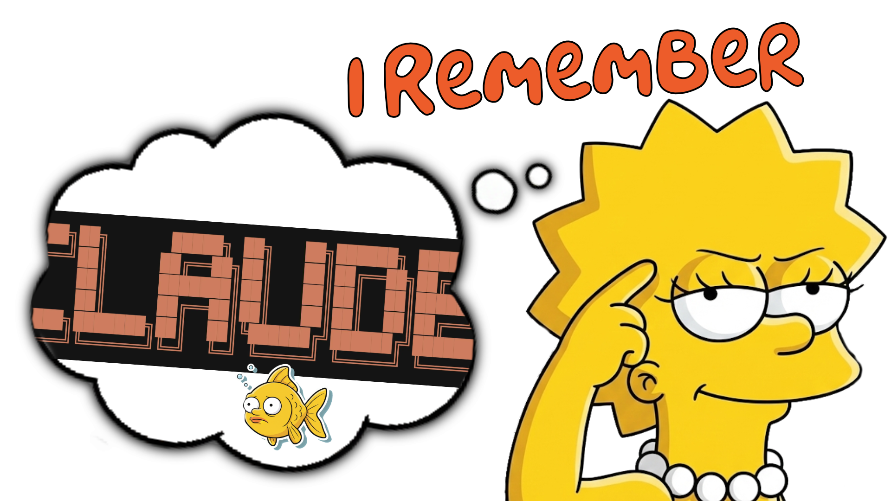

# Lisa – Long Term Memory for Claude




> *Lisa Simpson - the overachiever who never forgets a fact, a detail, or a saxophone lesson.*

---

## Why Lisa?

Unlike simple vector databases or file-based memory, Lisa uses **[Graphiti](https://github.com/getzep/graphiti)** - a knowledge graph that captures *relationships* between concepts, not just text.

- **Graph-native storage** (Neo4j) - Connections matter as much as content
- **LLM-powered extraction** - Automatically identifies entities and relationships
- **Temporal awareness** - Knows *when* you learned something
- **Semantic retrieval** - Finds relevant context by meaning, not keywords

---

## To Install

### From your console, in your project folder
```bash
npm install @tonycasey/lisa
```

## Using Lisa

Once installed, Lisa works automatically. Your AI assistant will:

1. **Load context at session start** - Previous memories and project context
2. **Capture important info during coding** - Decisions, patterns, etc.
3. **Remember explicitly when asked** - Say "remember that..." to save important notes

### Explicit Memory Commands

During a Claude Code session:

- "remember that we decided to use Redux for state management"
- "hey lisa, what do you know about the authentication system?"
- "lisa, show me recent memories"
- "lisa, what tasks are we working on?"

See the [Getting Started Guide](./docs/getting-started.md)  
---

[Contributing](./CONTRIBUTING.md) | [Changelog](./CHANGELOG.md)
