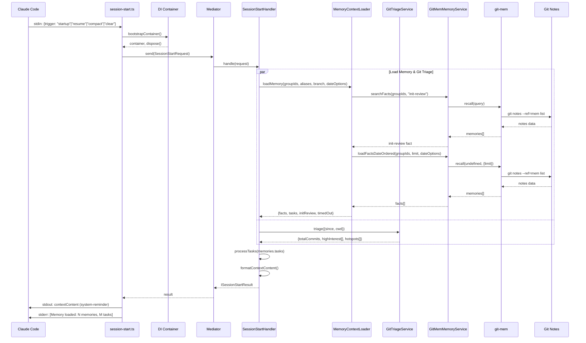
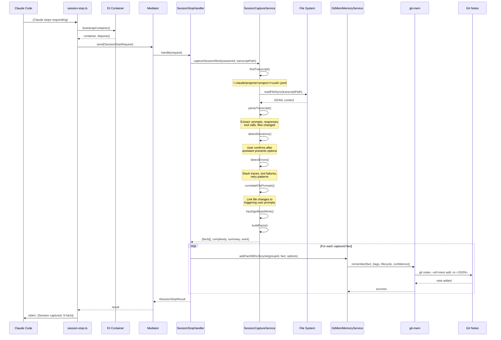
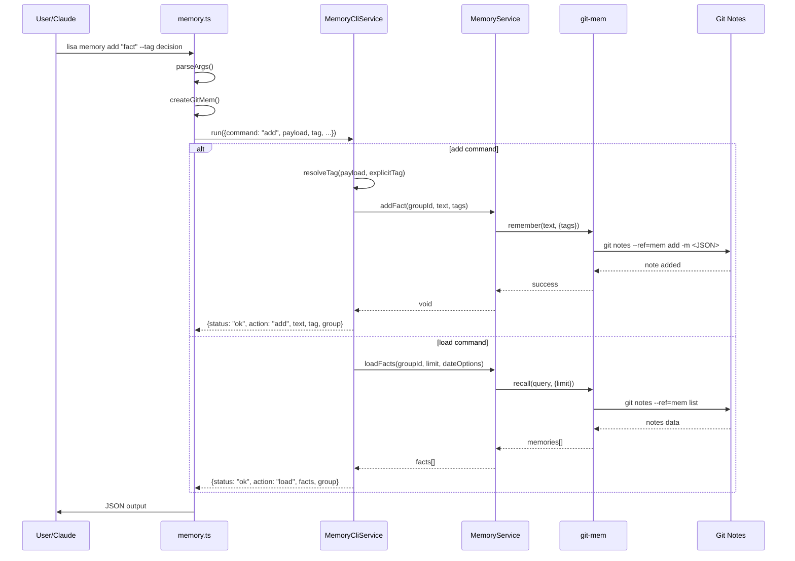
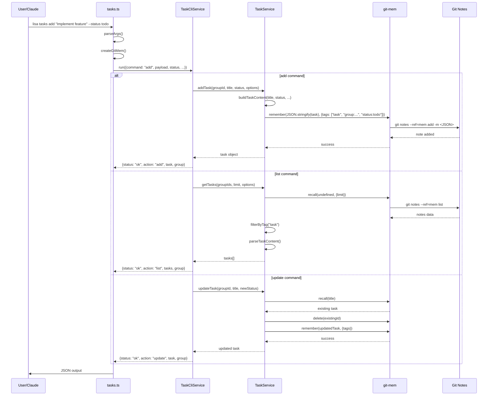
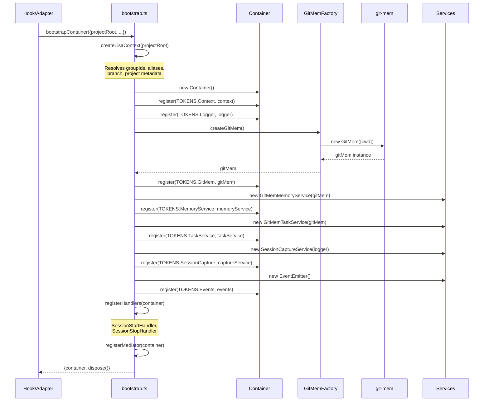

# Lisa Architecture Flows

This document describes the key data flows in the Lisa memory system.

## Table of Contents

- [Session Start Flow](#session-start-flow)
- [Session Stop Flow](#session-stop-flow)
- [Memory Skill Flow](#memory-skill-flow)
- [Tasks Skill Flow](#tasks-skill-flow)
- [DI Container Bootstrap](#di-container-bootstrap)
- [Memory Storage](#memory-storage)

---

## Session Start Flow

The session-start hook runs when Claude Code starts, resumes, compacts, or clears a session. It loads memory context to provide continuity across sessions.

### Sequence Diagram



### Trigger Types

| Trigger | When | Date Range |
|---------|------|------------|
| `startup` | Initial session start | Since midnight today |
| `resume` | Resuming paused session | Last 24 hours |
| `compact` | After auto-compaction | Last 24 hours |
| `clear` | After /clear command | Last 24 hours |

### What Gets Loaded

1. **Init Review** - Project overview from first session
2. **Facts** - Memories filtered by group and date range
3. **Tasks** - Active tasks with status
4. **Git Triage** - Recent commit analysis with interest scoring
5. **Hotspots** - Frequently modified files

### Key Files

| File | Role |
|------|------|
| `infrastructure/adapters/claude/session-start.ts` | Entry point (Claude hook) |
| `application/handlers/SessionStartHandler.ts` | Orchestrates loading |
| `application/services/MemoryContextLoader.ts` | Memory + task loading |
| `application/services/GitTriageService.ts` | Commit analysis |
| `application/services/SessionContextFormatter.ts` | Output formatting |
| `infrastructure/services/GitMemMemoryService.ts` | git-mem adapter |

---

## Session Stop Flow

The session-stop hook runs when Claude stops responding. It analyzes the session transcript and captures significant work as memories.

### Sequence Diagram



### What Gets Captured

| Detection | Method | Example |
|-----------|--------|---------|
| **Session stats** | Message counting | "5 prompts, 8 responses, 12 tool calls" |
| **File changes** | Summary parsing | "Created: foo.ts. Modified: index.ts" |
| **Decisions** | Confirmation pattern matching | "DECISION: Use PostgreSQL for JSON support" |
| **Errors** | Stack trace / error type detection | "ERROR: TypeError: Cannot read 'x' of undefined" |
| **File correlations** | User prompt to file change mapping | "FILE-CONTEXT: auth.ts - triggered by: add validation" |

### Detection Patterns

**Decisions**: User message matches confirmation pattern (`yes`, `ok`, `sounds good`, etc.) preceded by assistant presenting options.

**Errors**:
- Stack traces (`at <function>`)
- Error types (`TypeError:`, `ReferenceError:`, etc.)
- Tool failures (`is_error: true`)
- Retry patterns (same tool called 3+ times consecutively)

### Significance Threshold

A session is captured if:
- At least 3 messages
- At least 1 user prompt and 1 assistant response
- AND one of:
  - Files created or modified
  - More than 2 tool calls
  - More than 5 total messages

### Tags Applied

```
type:session-capture
source:session-capture
confidence:medium
lifecycle:session
taskType:<detected-type>  (if detected)
```

### Key Files

| File | Role |
|------|------|
| `infrastructure/adapters/claude/session-stop.ts` | Entry point (Claude hook) |
| `application/handlers/SessionStopHandler.ts` | Orchestrates capture + save |
| `infrastructure/services/SessionCaptureService.ts` | Transcript parsing + fact extraction |
| `infrastructure/services/GitMemMemoryService.ts` | git-mem adapter |

---

## Memory Skill Flow

The `/memory` skill provides CLI access to add and load memories. Used by Claude Code via skill invocation.

### Sequence Diagram



### Commands

| Command | Description | Example |
|---------|-------------|---------|
| `add` | Store a new memory | `lisa memory add "DECISION: Use PostgreSQL" --tag decision` |
| `load` | Retrieve memories | `lisa memory load --limit 20 --since today` |
| `expire` | Remove a specific memory | `lisa memory expire --uuid abc123` |
| `cleanup` | Remove expired memories | `lisa memory cleanup --dry-run` |

### Auto-Tag Detection

The memory service automatically detects tags from content prefixes:

| Prefix | Auto-Tag |
|--------|----------|
| `DECISION:` | `code:decision` |
| `BUG:` | `context:bug` |
| `GOTCHA:` | `context:gotcha` |
| `CONVENTION:` | `code:convention` |
| `MILESTONE:` | `milestone` |

### Key Files

| File | Role |
|------|------|
| `skills/memory/memory.ts` | CLI entry point |
| `skills/shared/services/MemoryCliService.ts` | Command routing |
| `skills/shared/services/MemoryService.ts` | Business logic |
| `skills/shared/clients/GitMemFactory.ts` | git-mem instance factory |

---

## Tasks Skill Flow

The `/tasks` skill provides CLI access to manage tasks. Tasks are stored as memories with the `task` tag.

### Sequence Diagram



### Commands

| Command | Description | Example |
|---------|-------------|---------|
| `add` | Create a new task | `lisa tasks add "Fix login bug" --status todo` |
| `list` | List tasks | `lisa tasks list --limit 10 --since 7d` |
| `update` | Update task status | `lisa tasks update "Fix login bug" --status done` |
| `link` | Link to external issue | `lisa tasks link abc123 --link github#42` |

### Task Status Flow

```
todo → doing → done
        ↓
     blocked
```

### Task Storage Format

Tasks are stored as JSON in git-mem with special tags:

```json
{
  "title": "Implement user authentication",
  "status": "doing",
  "repo": "lisa",
  "assignee": "tony",
  "created_at": "2024-01-15T10:30:00Z"
}
```

Tags: `task`, `group:<id>`, `status:<status>`, `task_id:<uuid>`

### Key Files

| File | Role |
|------|------|
| `skills/tasks/tasks.ts` | CLI entry point |
| `skills/shared/services/TaskCliService.ts` | Command routing |
| `skills/shared/services/TaskService.ts` | Business logic |
| `skills/shared/clients/GitMemFactory.ts` | git-mem instance factory |

---

## DI Container Bootstrap

The DI (Dependency Injection) container wires up all services for hooks and infrastructure code.

### Sequence Diagram



### Token Registry

| Token | Service | Description |
|-------|---------|-------------|
| `TOKENS.Context` | `ILisaContext` | Project metadata, group IDs |
| `TOKENS.Logger` | `ILogger` | Logging service |
| `TOKENS.GitMem` | `GitMem` | git-mem library instance |
| `TOKENS.MemoryService` | `GitMemMemoryService` | Memory operations |
| `TOKENS.TaskService` | `GitMemTaskService` | Task operations |
| `TOKENS.SessionCapture` | `SessionCaptureService` | Transcript analysis |
| `TOKENS.Events` | `IEventEmitter` | Internal event bus |
| `TOKENS.Mediator` | `IMediator` | Request/handler dispatch |

### Dispose Pattern

The `dispose()` function returned by bootstrap cleans up resources:

```typescript
const { container, dispose } = await bootstrapContainer(options);
try {
  // Use container...
} finally {
  await dispose(); // Clean up connections
}
```

### Key Files

| File | Role |
|------|------|
| `infrastructure/di/bootstrap.ts` | Container setup |
| `infrastructure/di/tokens.ts` | DI token definitions |
| `infrastructure/di/Container.ts` | IoC container implementation |

---

## Memory Storage

All memories are stored in git notes at `refs/notes/mem`.

### Storage Format

```json
{
  "id": "uuid",
  "content": "The memory text",
  "tags": ["group:project-name", "type:decision", "confidence:high"],
  "createdAt": "2024-01-15T10:30:00Z",
  "lifecycle": "project",
  "confidence": "high"
}
```

### Tag Conventions

| Tag Pattern | Purpose | Examples |
|-------------|---------|----------|
| `group:<id>` | Isolate by project/context | `group:lisa`, `group:users-tony-repos-lisa` |
| `type:<name>` | Memory category | `type:decision`, `type:milestone`, `type:session-capture` |
| `status:<status>` | Task status | `status:todo`, `status:doing`, `status:done` |
| `lifecycle:<tier>` | Retention tier | `lifecycle:permanent`, `lifecycle:project`, `lifecycle:session` |
| `confidence:<level>` | Trust level | `confidence:verified`, `confidence:high`, `confidence:medium` |
| `source:<origin>` | How it was created | `source:user`, `source:session-capture`, `source:llm-extracted` |
| `task` | Marks task entries | `task` |

### CLI Access

```bash
# View all notes
git notes --ref=mem list

# View specific note
git notes --ref=mem show <commit-sha>

# Search via git-mem CLI
git mem recall "search query"

# Add via git-mem CLI
git mem remember "fact text" --tags "type:decision"
```

---

## See Also

- [git-mem Library](https://github.com/TonyCasey/git-mem)
- [CLAUDE.md](../../CLAUDE.md) - Project overview and development workflow
